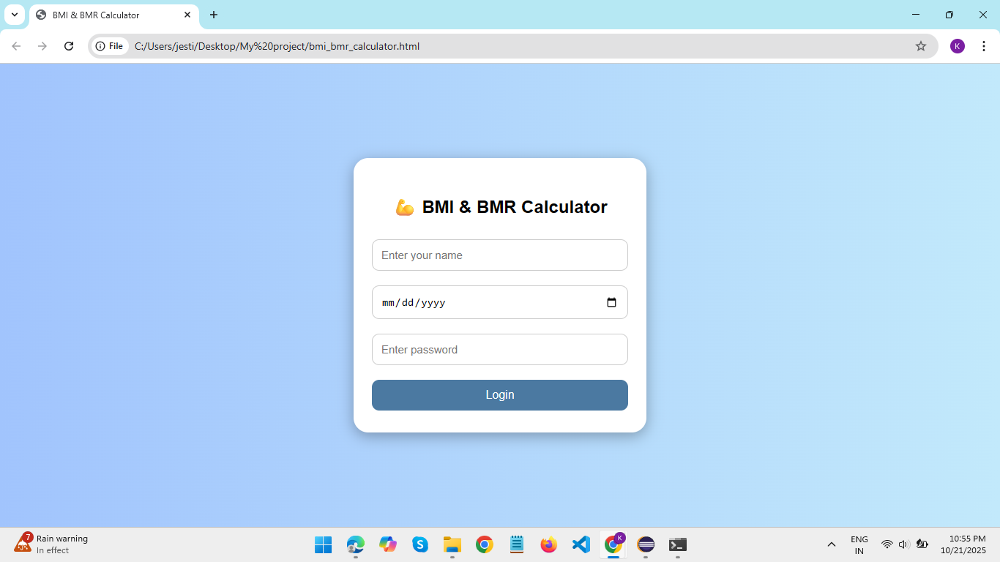
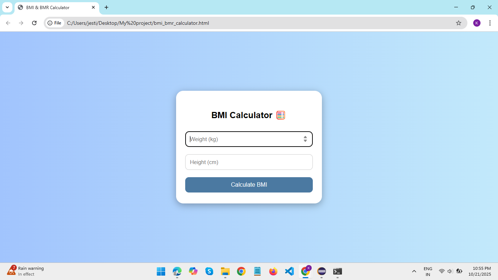
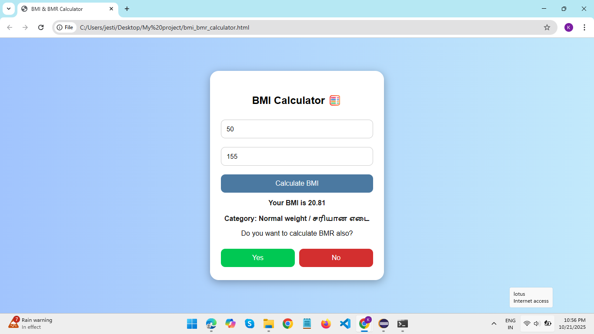
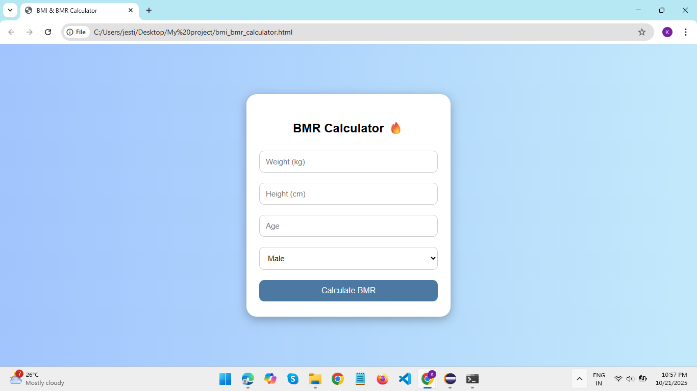
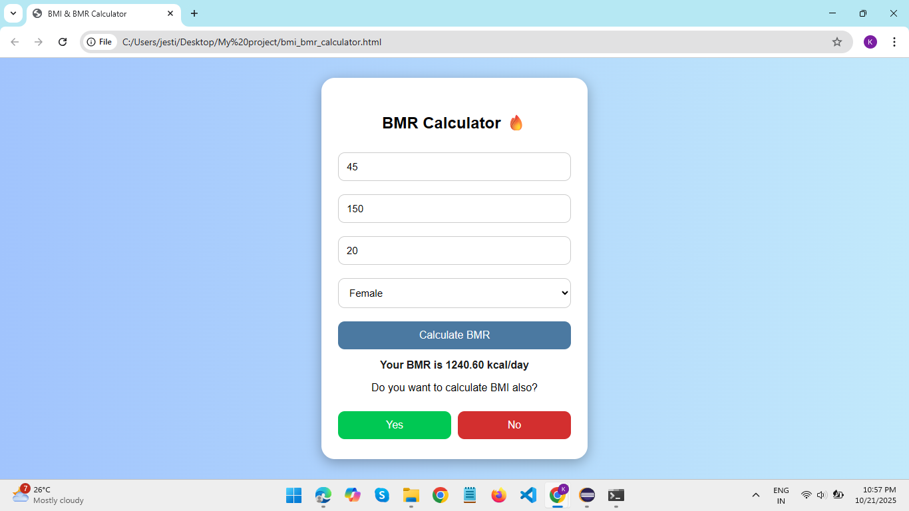

# BMI & BMR Calculator

A simple **BMI & BMR Calculator** built using **React**, **HTML**, and **CSS**.  
It allows users to log in, calculate BMI with categories, calculate BMR based on weight, height, age, and gender, and navigate between calculations easily.

## Features
- User login (name, date of birth, password)
- BMI calculation with category
- BMR calculation based on gender
- Navigation between BMI and BMR calculations
- Responsive and modern UI

## How It Works
1. The user first **logs in** by providing their name, date of birth, and password.
2. After login, the user is presented with options to **calculate either BMI or BMR**.
3. Once the user completes a calculation, the app asks if they want to perform the other calculation.
4. The user can **switch between BMI and BMR calculations** as many times as they want.
5. The results are displayed with clear messages, including BMI category or BMR in kcal/day.

## Output

### BMI & BMR Calculator Screenshots

1. 
2. 
3. 
4. 
5. 
6. 
7. 

